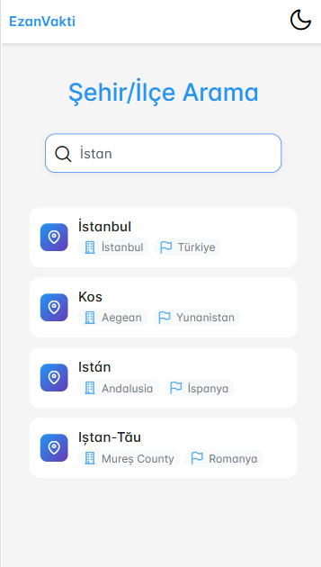
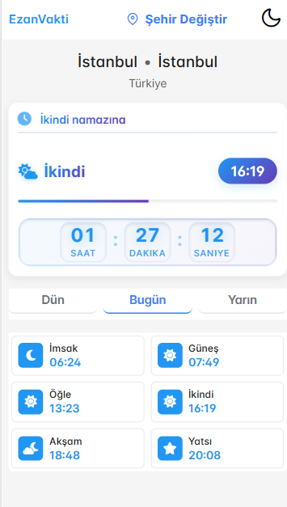

# Vakit

Bu proje, [Namaz Vakti API](https://github.com/canbax/namaz-vakti-api) kullanılarak ve VS Code Agent ile oluşturulmuş bir namaz vakti uygulamasıdır.

## Kullanım

1. Depoyu klonlayın:
   ```sh
   git clone <repo-url>
   cd vakit
   ```
2. Bağımlılıkları yükleyin:
   ```sh
   npm install
   ```
3. Geliştirme sunucusunu çalıştırın:
   ```sh
   ng serve
   ```
   Uygulamayı tarayıcıda açmak için: [http://localhost:4200](http://localhost:4200)

## API

Bu proje, namaz vakitlerini almak için [Canbax](https://github.com/canbax)'ın sağladığı API'yi kullanmaktadır. Kendisine teşekkür ederiz!

## Görseller

## Görseller

Projeden bazı ekran görüntüleri:

<div style="display: flex; gap: 10px;">
  
  
</div>

Namaz Vakti API'yi sağladığı için [Canbax](https://github.com/canbax)'a teşekkür ederiz!

